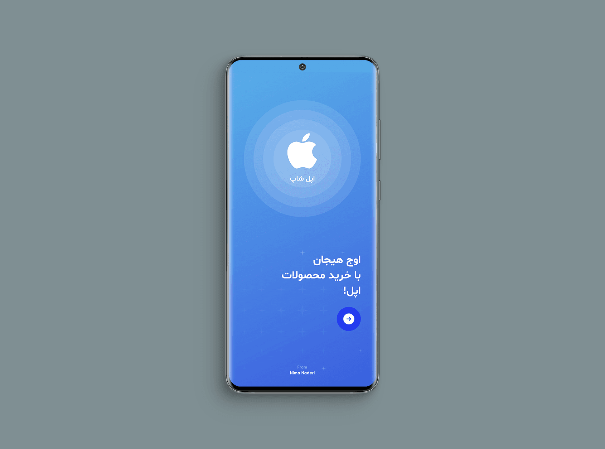
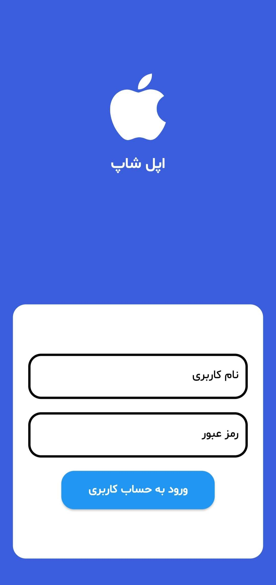
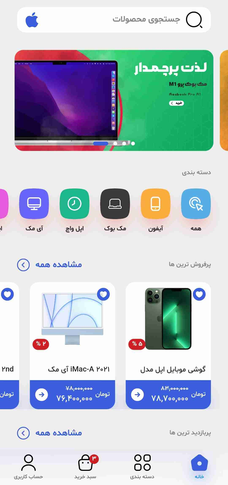
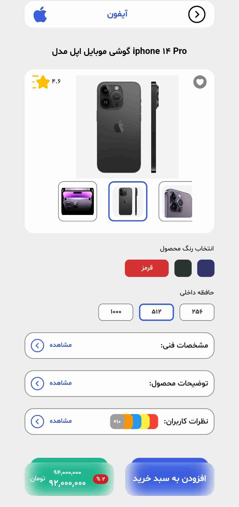
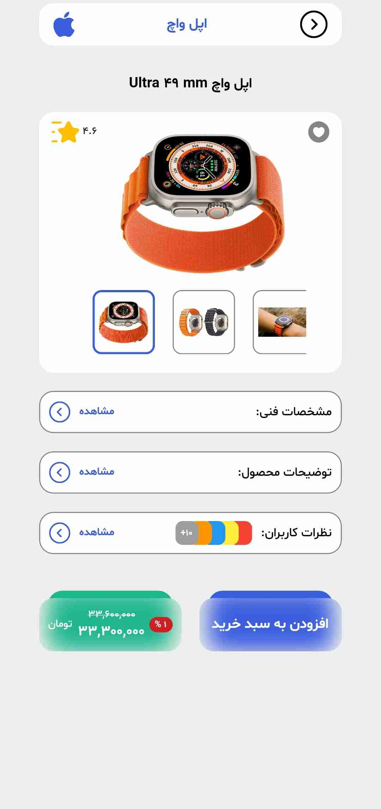
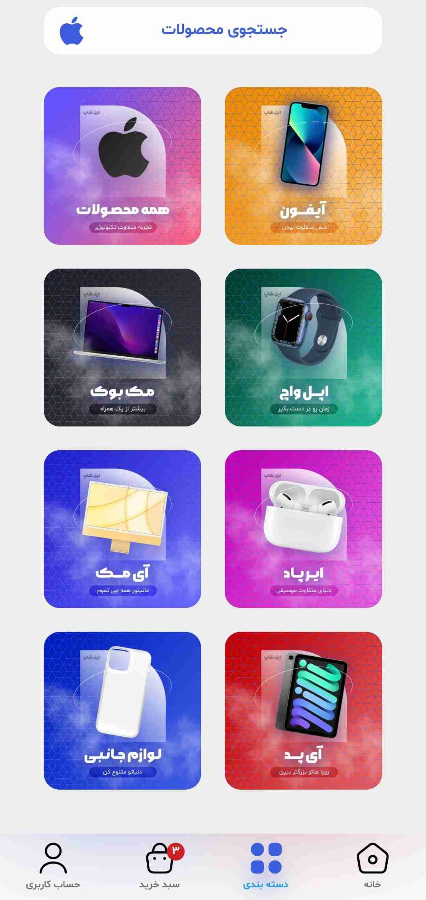
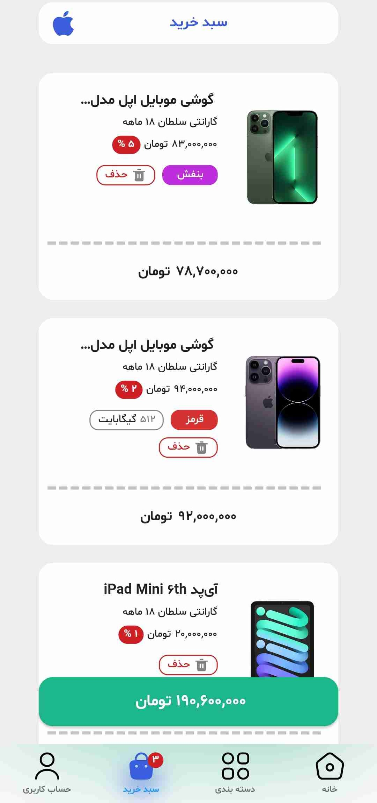
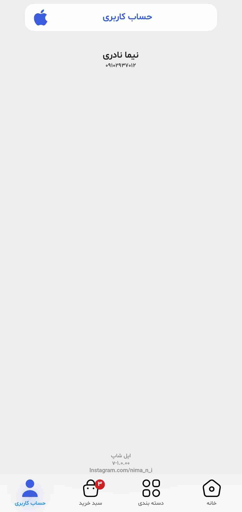

A Shopping Store Project

Implemented By =>

Bloc Architecture Pattern
Repository Pattern
Hive Database
Rest API ( Dio )
Dependency Injection ( Get It )

<!--          -->

Repository Will Updated As Soon As New Features And Updates Added !
